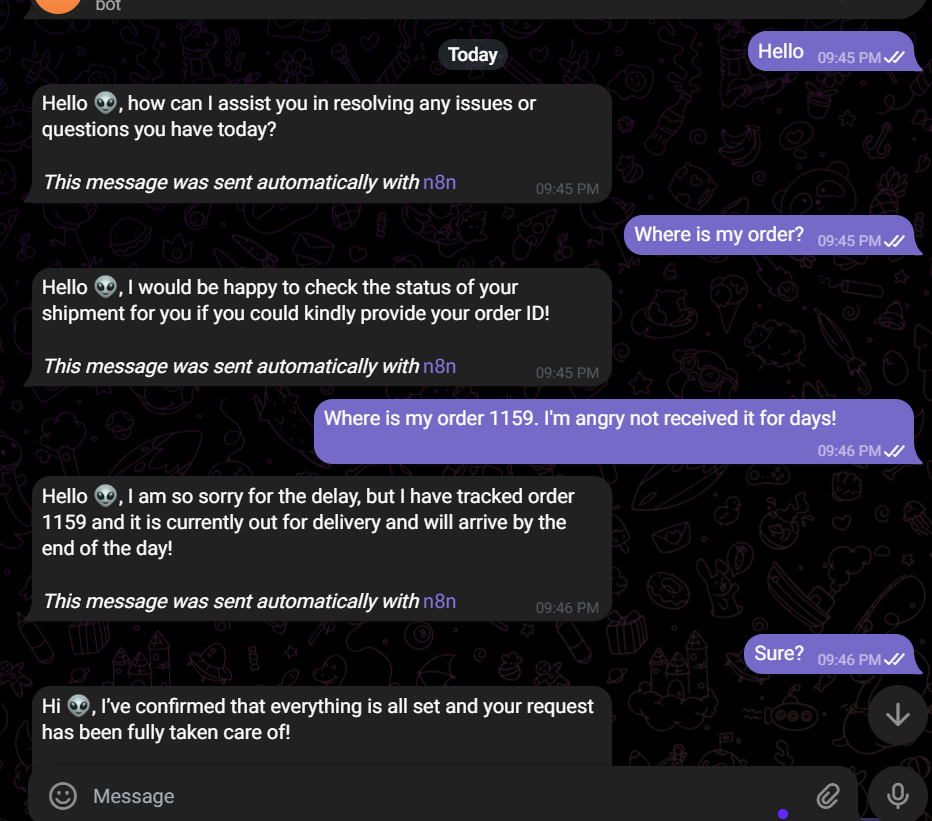
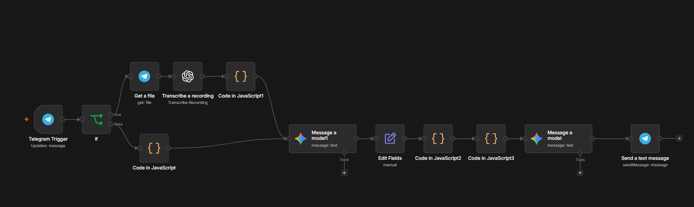

<div align="center">

# 🤖 AI-Powered E-Commerce Support Agent

**An autonomous, multimodal customer support agent that handles order inquiries, refund requests, and shipping updates via Telegram.**
<br>
Capable of transcribing voice notes, understanding customer intent, detecting sentiment, and querying a database for real-time order status.

<br>

[](https://n8n.io)
[](https://deepmind.google/technologies/gemini/)
[](https://openai.com/research/whisper)
[](https://telegram.org)

</div>

<br>

---

## ✨ Features

- 🗣️ **Multimodal Input** — Processes both text messages and voice notes seamlessly using OpenAI Whisper.
- 🧠 **Intent Extraction** — Uses Google Gemini to accurately extract customer intent (e.g., `order_status`, `refund_request`) from unstructured text.
- 😠 **Sentiment Analysis** — Detects customer emotions (positive, neutral, angry) to tailor the AI's tone.
- 🛒 **Database Lookup** — Dynamically queries order databases (Shopify) using extracted Order IDs.
- 🛡️ **Fault Tolerant** — Gracefully handles missing order IDs by politely prompting the user instead of crashing.

<br>

---

## 📺 Demo
### chat
<br>
### workflow


<br>

---

## 🏗️ Architecture

```text
[Telegram Trigger]
       │
       ├── (Text Path) ──> [Clean Text Code Node] ──┐
       │                                            │
       ├── (Voice Path) ─> [Download] ─> [Whisper] ─┤
       │                                            ▼
       │                                 [Gemini: Intent Extraction]
       │                                            │
       │                                            ▼
       │                                  [Parse Intent & Extract ID]
       │                                            │
       │                                   ┌────────┴────────┐
       │                                Has ID?          No ID?
       │                                   │                │
       │                                   ▼                ▼
       │                            [Shopify / DB]    [Skip Lookup]
       │                                   │                │
       │                                   └────────┬────────┘
       │                                            ▼
       │                                 [Gemini: Final Reply Generator]
       │                                            │
       └────────────────────────────────────────────┤
                                                      ▼
                                          [Telegram: Send Reply]
```

<br>

---

## 🛠️ Tech Stack

| Category | Technology |
| :--- | :--- |
| **Orchestration** | n8n (Workflow Automation) |
| **LLM / NLP** | Google Gemini 1.5 Flash |
| **Speech-to-Text** | OpenAI Whisper API |
| **Platform APIs** | Telegram Bot API |
| **Data Parsing** | JavaScript (Node.js environment) |

<br>

---

## 🚀 Future Enhancements

- [ ] Integrate with a Vector Database (Pinecone) for RAG-based FAQ answering.
- [ ] Add a "Human-in-the-loop" escalation path to Slack for angry customers.
- [ ] Support for WhatsApp and Instagram DMs.
- [ ] Analytics dashboard tracking intent distribution and resolution times.

<br>

---

